<div align="center">

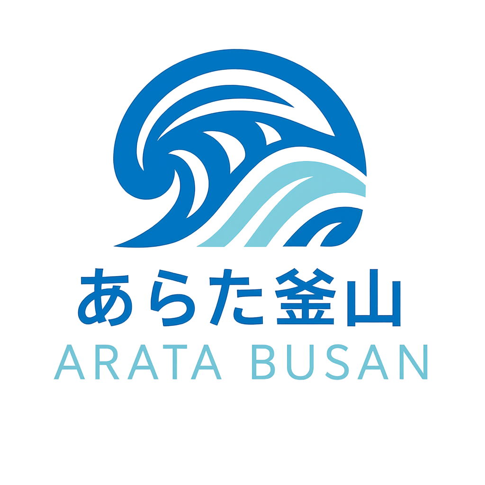

**언어 선택 / 言語選択**

[](#readme-ko)　[](#readme-ja)

</div>

---

<a id="readme-ko"></a>

## 📖 한국어

> **새로운 부산을 발견하다** — 부산의 숨겨진 보석 같은 관광지와 특별한 경험을 찾아보세요

### 프로젝트 소개

**あらた釜山(아라타 부산)**은 부산 관광 정보를 제공하는 종합 웹 플랫폼입니다. 일본어로 "새로운"을 의미하는 "あらた"와 부산을 결합하여, 기존과는 다른 새로운 시각으로 부산의 매력을 소개하는 인터랙티브 관광 가이드입니다.

### 🎯 주요 목표

- 부산 16개 구·군의 관광지 정보 체계적 제공
- 해시태그·테마·지역·통합 검색 기반 스마트 검색
- 카카오맵 연동을 통한 위치 기반 서비스
- 사용자 친화적 반응형 웹 인터페이스
- 관리자 시스템을 통한 효율적 콘텐츠·회원·신청 관리

### ✨ 주요 기능

- **다중 검색**: 지역별·해시태그·테마별·통합 검색
- **카카오맵 연동**: 실시간 지도, 마커 필터링, 관광지 상세
- **인터랙티브 UX**: Hero 슬라이더, 스크롤 애니메이션, 반응형
- **상세 페이지**: Swiper 갤러리, 좋아요/리뷰/댓글/북마크
- **사용자·관리자**: 회원가입, 권한 관리, 대시보드, 마이페이지·프로필

### 🆕 추가 구현 기능 (백엔드·기능 확장)

| 구분          | 기능                                                                                           |
| ------------- | ---------------------------------------------------------------------------------------------- |
| **백엔드**    | Spring Boot 3.5.x, Java 17, MySQL, MyBatis, Thymeleaf + Layout Dialect                         |
| **인증**      | 일반 로그인/회원가입, **카카오·구글 OAuth2 소셜 로그인**, 아이디 찾기, 비밀번호 재설정         |
| **사용자**    | 마이페이지, 프로필 수정(이미지 포함), **타인 프로필** 보기(리뷰 탭)                            |
| **관광지**    | 지역/태그/테마/통합 검색 API, 상세 조회, 조회수, **관광지·사진 추가 신청**, **정보 수정 요청** |
| **리뷰·소셜** | 리뷰 작성·수정·삭제, **리댓글**, **리뷰/관광지 좋아요**, **리뷰·댓글 신고**                    |
| **파일**      | 관광지/프로필/리뷰 **이미지 업로드** 및 URL 서빙                                               |
| **관리자**    | 관광지·사용자·**공통코드**·**신청(spot-requests)**·**신고** 관리, 대시보드                     |
| **다국어**    | 한국어·일본어·영어 **언어 선택** (data-translate 기반)                                         |
| **보안**      | Spring Security, 세션 기반 인증, 역할별 접근 제어(ADMIN/MEMBER)                                |

### 📸 스크린샷

<details>
<summary>스크린샷 보기 (클릭하여 펼치기)</summary>

| 메인                                                    | 부산 소개                                                                | 지역 검색                                                      |
| ------------------------------------------------------- | ------------------------------------------------------------------------ | -------------------------------------------------------------- |
| 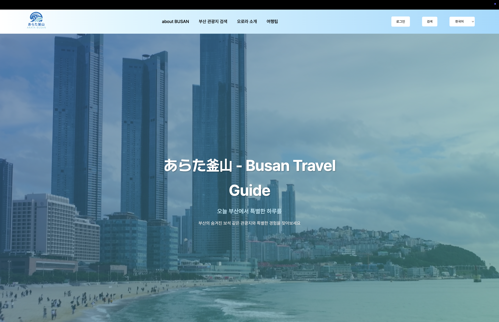 | 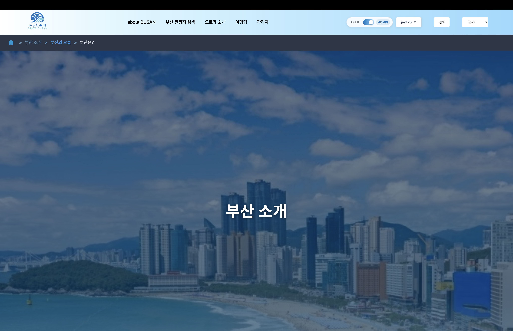 | 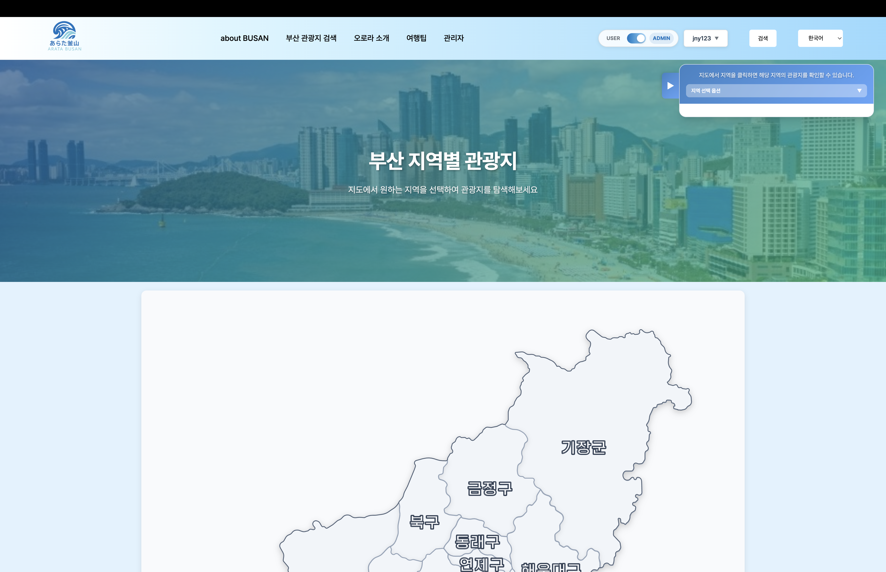 |

| 태그·테마 검색                                                                                                                | 관광지 상세 & 리뷰·댓글                                                                                                                  |
| ----------------------------------------------------------------------------------------------------------------------------- | ---------------------------------------------------------------------------------------------------------------------------------------- |
| 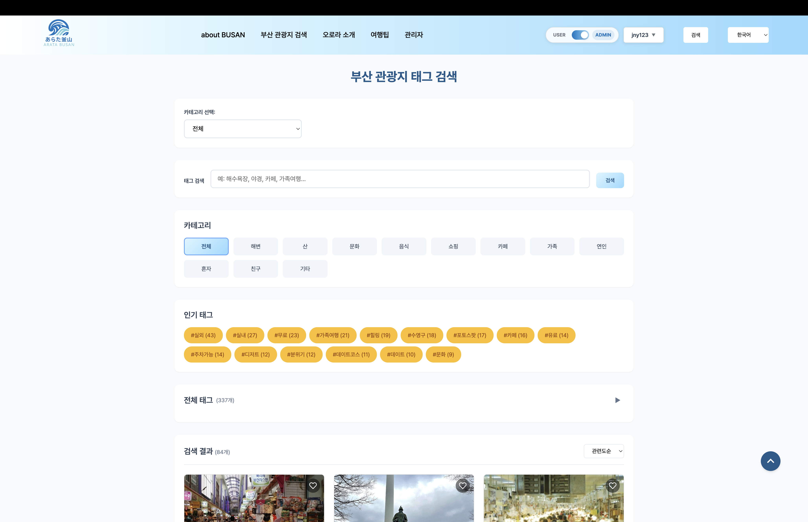 · 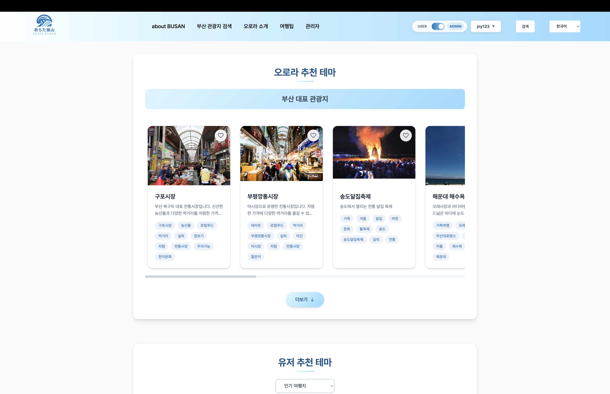 | 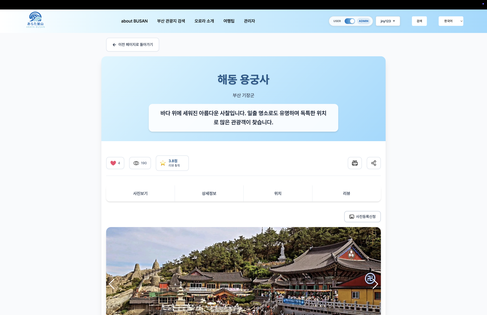 · 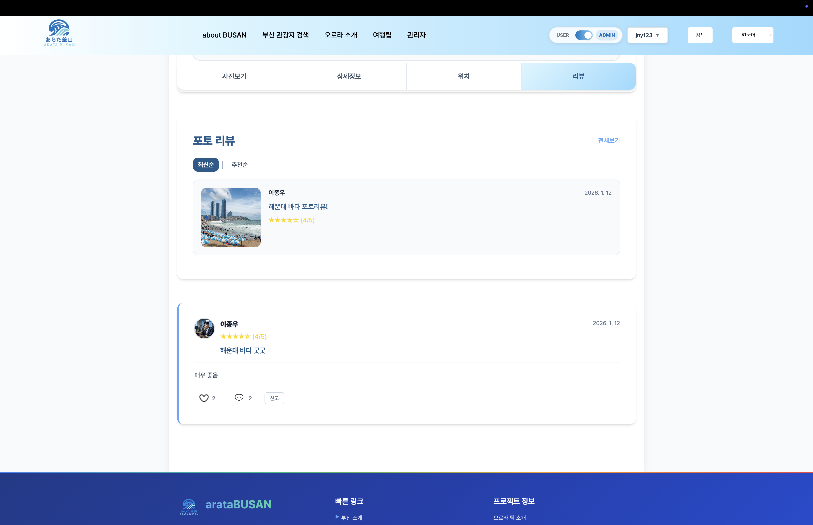 |

| 여행 팁                                                       | 관리자                                                          |
| ------------------------------------------------------------- | --------------------------------------------------------------- |
| 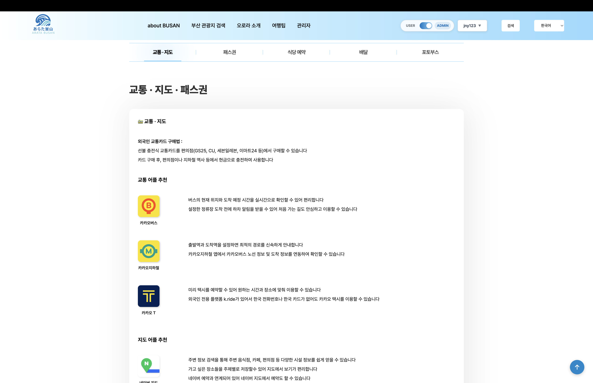 | 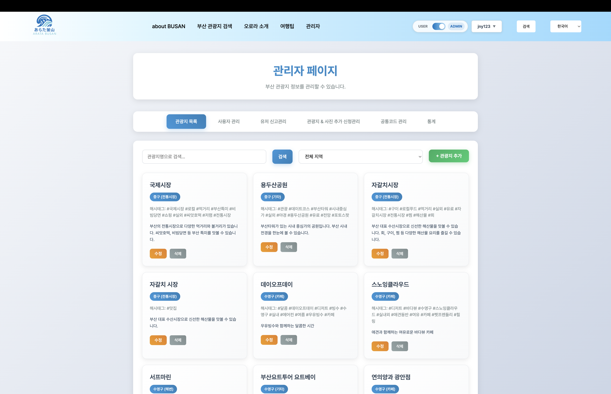 |

| 다국어(한국어)                                                    | 다국어(일본어)                                                    | 다국어(영어)                                                      |
| ----------------------------------------------------------------- | ----------------------------------------------------------------- | ----------------------------------------------------------------- |
| 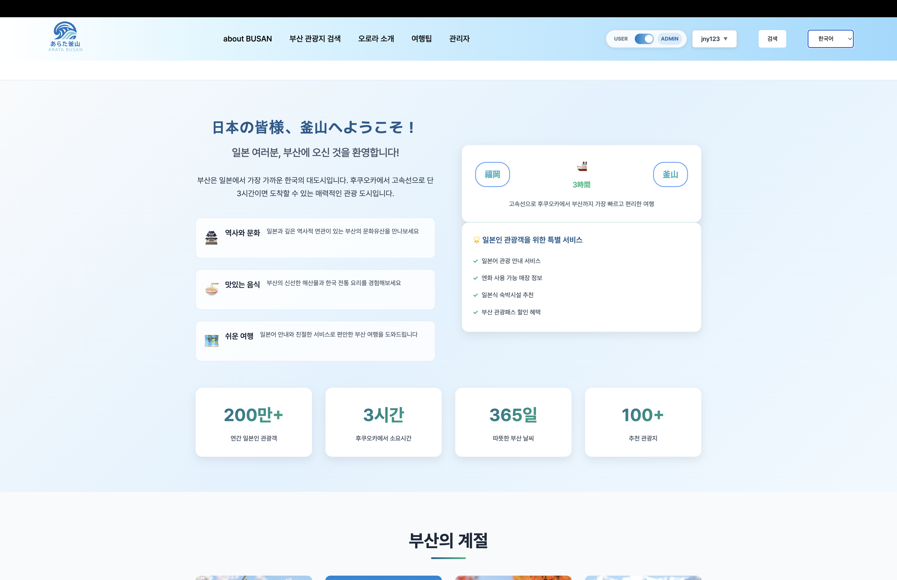 | 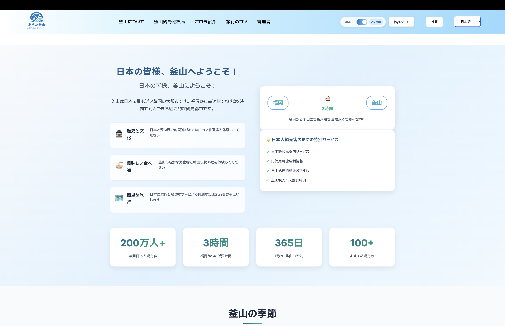 | 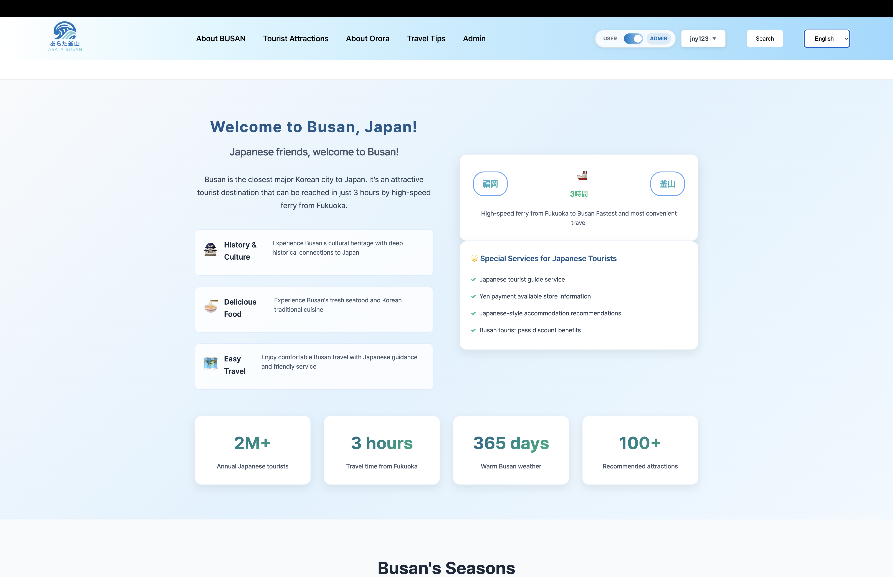 |

</details>

### 🛠️ 기술 스택

- **Backend**: Spring Boot 3.5.x, Java 17, Gradle, MySQL, MyBatis, Spring Security, OAuth2 Client
- **Frontend**: HTML5, CSS3, JavaScript(ES6+), Pretendard
- **View**: Thymeleaf, Layout Dialect
- **Libraries**: Kakao Maps API, Swiper.js, Font Awesome
- **Data**: JSON, 로컬 스토리지, 모듈식 컴포넌트

### 🚀 시작하기

1. **저장소 클론**

    ```bash
    git clone https://github.com/QCoQCo/ORORAproject.git
    cd ORORAproject
    ```

2. **카카오맵 API 키 설정**  
   `src/main/resources/static/js/kakaoMap/script.js`에서 Kakao Developers 발급 JavaScript 키 입력

3. **환경 설정**  
   `application.yaml`(또는 `.env`)에 DB, OAuth2(카카오/구글) 등 설정

4. **실행**

    ```bash
    ./gradlew bootRun
    ```

    접속: `http://localhost:8080` (또는 설정한 포트)

### 📁 프로젝트 구조 (핵심)

- `src/main/java/com/busan/orora/` — 컨트롤러, 서비스, Mapper, config, user/spot/review/like/search 등
- `src/main/resources/` — `application.yaml`, `mapper/`, `templates/`, `static/`(css, js, images, data)
- 메인: `/`, 검색: `/pages/search-place/place|tag|theme|search`, 상세: `/pages/detailed/detailed?id=`, 관리자: `/pages/admin/management`

### 📱 페이지별 기능 요약

- **메인**: Hero 슬라이더, 네비게이션 카드, 부산 소개, 사계절 섹션
- **지역/태그/테마 검색**: 인터랙티브 지도·필터, 리스트뷰
- **통합 검색**: 키워드 검색
- **관광지 상세**: Swiper 갤러리, 좋아요·리뷰·댓글·북마크·공유, 지도 보기
- **마이페이지**: 작성 리뷰/좋아요한 리뷰·관광지/댓글, 프로필 수정
- **관리자**: 관광지·사용자·공통코드·신청·신고 관리, 통계

### 👥 팀 ORORA

**팀원 소개**

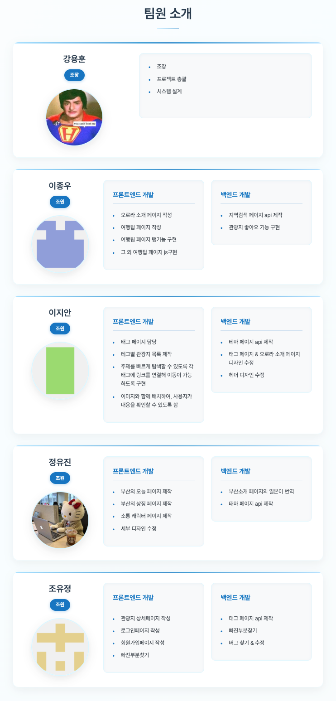

| 팀원   | 역할 | GitHub                                       |
| ------ | ---- | -------------------------------------------- |
| 강용훈 | 팀장 | [@QCoQCo](https://github.com/QCoQCo)         |
| 이종우 | 조원 | [@jongw0o0](https://github.com/jongw0o0)     |
| 이지안 | 조원 | [@jian080](https://github.com/jian080)       |
| 정유진 | 조원 | [@levihisoka](https://github.com/levihisoka) |
| 조유정 | 조원 | [@JOYJ125](https://github.com/JOYJ125)       |

**© 2025 arataBUSAN by Team ORORA.**

---

<a id="readme-ja"></a>

## 📖 日本語

> **新しい釜山を発見する** — 釜山の隠れた名所と特別な体験をご紹介します

### プロジェクト紹介

**あらた釜山（アラタ釜山）**は、釜山の観光情報を提供する総合ウェブプラットフォームです。日本語の「新しい」を意味する「あらた」と釜山を組み合わせ、これまでとは違う視点で釜山の魅力を伝えるインタラクティブな観光ガイドです。

### 🎯 主な目標

- 釜山16区の観光スポット情報を体系的に提供
- ハッシュタグ・テーマ・地域・統合検索によるスマート検索
- カカオマップ連携による位置情報サービス
- 使いやすいレスポンシブWebインターフェース
- 管理画面によるコンテンツ・会員・申請の運用

### ✨ 主な機能

- **複合検索**: 地域・ハッシュタグ・テーマ・統合検索
- **カカオマップ連携**: 地図表示、マーカーフィルター、スポット詳細
- **インタラクティブUX**: ヒーロースライダー、スクロールアニメーション、レスポンシブ
- **詳細ページ**: Swiperギャラリー、いいね・レビュー・コメント・ブックマーク
- **ユーザー・管理**: 会員登録、権限管理、ダッシュボード、マイページ・プロフィール

### 🆕 追加実装機能（バックエンド・機能拡張）

| 区分                     | 機能                                                                                                 |
| ------------------------ | ---------------------------------------------------------------------------------------------------- |
| **バックエンド**         | Spring Boot 3.5.x, Java 17, MySQL, MyBatis, Thymeleaf + Layout Dialect                               |
| **認証**                 | 一般ログイン・会員登録、**カカオ・Google OAuth2 ソーシャルログイン**、ID検索、パスワード再設定       |
| **ユーザー**             | マイページ、プロフィール編集（画像含む）、**他者プロフィール**表示（レビュータブ）                   |
| **観光スポット**         | 地域/タグ/テーマ/統合検索API、詳細表示、閲覧数、**観光地・写真追加申請**、**情報修正申請**           |
| **レビュー・ソーシャル** | レビュー投稿・編集・削除、**返信コメント**、**レビュー・スポットいいね**、**レビュー・コメント通報** |
| **ファイル**             | 観光地/プロフィール/レビュー **画像アップロード** 及びURL配信                                        |
| **管理**                 | 観光地・ユーザー・**共通コード**・**申請(spot-requests)**・**通報**管理、ダッシュボード              |
| **多言語**               | 韓国語・日本語・英語 **言語選択**（data-translate対応）                                              |
| **セキュリティ**         | Spring Security、セッション認証、ロール別アクセス制御(ADMIN/MEMBER)                                  |

### 📸 スクリーンショット

<details>
<summary>スクリーンショットを見る（クリックして展開）</summary>

| メイン                                                    | 釜山紹介                                                                    | 地域検索                                                      |
| --------------------------------------------------------- | --------------------------------------------------------------------------- | ------------------------------------------------------------- |
|  | 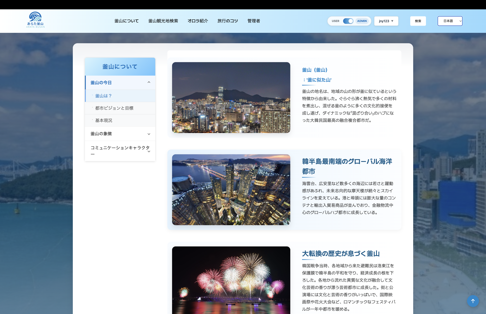 |  |

| タグ・テーマ検索                                                                                                                | 観光地詳細 & レビュー・コメント                                                                                                              |
| ------------------------------------------------------------------------------------------------------------------------------- | -------------------------------------------------------------------------------------------------------------------------------------------- |
|  ·  |  ·  |

| 旅行のコツ                                                        | 管理画面                                                      |
| ----------------------------------------------------------------- | ------------------------------------------------------------- |
|  |  |

| 多言語(韓国語)                                                    | 多言語(日本語)                                                    | 多言語(英語)                                                      |
| ----------------------------------------------------------------- | ----------------------------------------------------------------- | ----------------------------------------------------------------- |
|  |  |  |

</details>

### 🛠️ 技術スタック

- **Backend**: Spring Boot 3.5.x, Java 17, Gradle, MySQL, MyBatis, Spring Security, OAuth2 Client
- **Frontend**: HTML5, CSS3, JavaScript(ES6+), Pretendard
- **View**: Thymeleaf, Layout Dialect
- **Libraries**: Kakao Maps API, Swiper.js, Font Awesome
- **Data**: JSON, ローカルストレージ, モジュールコンポーネント

### 🚀 はじめに

1. **リポジトリのクローン**

    ```bash
    git clone https://github.com/QCoQCo/ORORAproject.git
    cd ORORAproject
    ```

2. **カカオマップAPIキー**  
   `src/main/resources/static/js/kakaoMap/script.js` でKakao DevelopersのJavaScriptキーを設定

3. **環境設定**  
   `application.yaml`（または `.env`）でDB・OAuth2（カカオ/Google）等を設定

4. **起動**

    ```bash
    ./gradlew bootRun
    ```

    アクセス: `http://localhost:8080`（または設定したポート）

### 📁 プロジェクト構成（要）

- `src/main/java/com/busan/orora/` — コントローラ、サービス、Mapper、config、user/spot/review/like/search 等
- `src/main/resources/` — `application.yaml`, `mapper/`, `templates/`, `static/`(css, js, images, data)
- メイン: `/`、検索: `/pages/search-place/place|tag|theme|search`、詳細: `/pages/detailed/detailed?id=`、管理: `/pages/admin/management`

### 📱 ページ別機能概要

- **メイン**: Heroスライダー、ナビカード、釜山紹介、四季セクション
- **地域/タグ/テーマ検索**: インタラクティブ地図・フィルター、リスト表示
- **統合検索**: キーワード検索
- **観光地詳細**: Swiperギャラリー、いいね・レビュー・コメント・ブックマーク・共有、地図表示
- **マイページ**: 投稿レビュー/いいねしたレビュー・スポット/コメント、プロフィール編集
- **管理画面**: 観光地・ユーザー・共通コード・申請・通報管理、統計

### 👥 チーム ORORA

**チーム紹介**

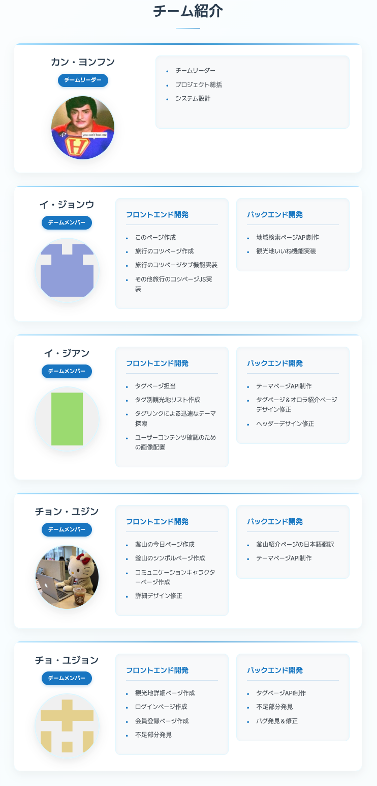

| メンバー       | 役割     | GitHub                                       |
| -------------- | -------- | -------------------------------------------- |
| カン・ヨンフン | リーダー | [@QCoQCo](https://github.com/QCoQCo)         |
| イ・ジョンウ   | メンバー | [@jongw0o0](https://github.com/jongw0o0)     |
| イ・ジアン     | メンバー | [@jian080](https://github.com/jian080)       |
| チョン・ユジン | メンバー | [@levihisoka](https://github.com/levihisoka) |
| チョ・ユジョン | メンバー | [@JOYJ125](https://github.com/JOYJ125)       |

**© 2025 arataBUSAN by Team ORORA.**

---

<div align="center">

[↑ 맨 위로 / トップへ](#readme-ko)

</div>
