# ORORA 프로젝트 메뉴 구조도

## 시각적 메뉴 구조도 (Mermaid)

```mermaid
graph TD
    A[ORORA 메인 페이지 /] --> B[about BUSAN]
    A --> C[부산 관광지 검색]
    A --> D[오로라 소개]
    A --> E[여행팁]
    A --> F[사용자 메뉴]
    A --> G[관광지 상세]
    A --> H[관리자 메뉴]
    
    B --> B1[부산의 오늘]
    B --> B2[부산의 상징]
    B --> B3[소통 캐릭터]
    
    B1 --> B1a[부산은? /pages/about-busan/busan]
    B1 --> B1b[기본현황 /pages/about-busan/basisinfo]
    B1 --> B1c[도시비전과 목표 /pages/about-busan/goals]
    
    B2 --> B2a[지역상징 /pages/about-busan/symbol]
    B3 --> B3a[캐릭터 소개 /pages/about-busan/character]
    
    C --> C1[지역 검색 /pages/search-place/place]
    C --> C2[태그 검색 /pages/search-place/tag]
    C --> C3[테마 검색 /pages/search-place/theme]
    C --> C4[통합 검색 /pages/search-place/search]
    
    F --> F1[로그인 /pages/login/login]
    F --> F1a[카카오 로그인 /oauth2/authorization/kakao]
    F --> F1b[구글 로그인 /oauth2/authorization/google]
    F --> F2[회원가입 /pages/login/signup]
    F --> F3[아이디 찾기 /pages/login/find-id]
    F --> F4[비밀번호 재설정 /pages/login/reset-password]
    F --> F5[마이페이지 /pages/mypage/mypage]
    F --> F6[프로필 수정 /pages/mypage/edit-profile]
    
    G --> G1[관광지 상세 /pages/detailed/detailed?id=spotId]
    
    H --> H1[관리자 페이지 /pages/admin/management]
    H --> H2[리스트 예시 /pages/search-place/list-simple]
    H --> H3[리스트 예시2 /pages/search-place/list-test]
    
    style A fill:#e1f5ff
    style B fill:#fff4e1
    style C fill:#e8f5e9
    style D fill:#f3e5f5
    style E fill:#fff9c4
    style F fill:#e3f2fd
    style G fill:#fce4ec
    style H fill:#ffebee
```



## 전체 메뉴 구조

```
ORORA (arataBUSAN)
│
├── 🏠 메인 페이지
│   └── / (index)
│
├── 📖 about BUSAN (부산 소개)
│   ├── 부산의 오늘
│   │   ├── /pages/about-busan/busan (부산은?)
│   │   ├── /pages/about-busan/basisinfo (기본현황)
│   │   └── /pages/about-busan/goals (도시비전과 목표)
│   │
│   ├── 부산의 상징
│   │   └── /pages/about-busan/symbol (지역상징)
│   │
│   └── 소통 캐릭터
│       └── /pages/about-busan/character (캐릭터 소개)
│
├── 🔍 부산 관광지 검색
│   ├── 지역 검색
│   │   └── /pages/search-place/place
│   │
│   ├── 관광지 태그 검색
│   │   └── /pages/search-place/tag
│   │
│   ├── 관광지 테마 검색
│   │   └── /pages/search-place/theme
│   │
│   └── 통합 검색
│       └── /pages/search-place/search
│
├── 🌟 오로라 소개
│   └── /pages/about-orora/orora-introduce
│
├── 💡 여행팁
│   └── /pages/tip/tip
│
├── 👤 사용자 메뉴
│   ├── 로그인
│   │   ├── /pages/login/login (일반 로그인)
│   │   ├── /oauth2/authorization/kakao (카카오 로그인)
│   │   └── /oauth2/authorization/google (구글 로그인)
│   │
│   ├── 회원가입
│   │   └── /pages/login/signup
│   │
│   ├── 아이디 찾기
│   │   └── /pages/login/find-id
│   │
│   ├── 비밀번호 재설정
│   │   └── /pages/login/reset-password
│   │
│   └── 마이페이지
│       ├── /pages/mypage/mypage (마이페이지 메인)
│       └── /pages/mypage/edit-profile (프로필 수정)
│
├── 📍 관광지 상세 페이지
│   └── /pages/detailed/detailed?id={spotId}
│
└── ⚙️ 관리자 메뉴 (관리자 전용)
    ├── 관리자 페이지
    │   └── /pages/admin/management
    │
    └── 개발/테스트 페이지
        ├── /pages/search-place/list-simple (리스트 예시)
        └── /pages/search-place/list-test (리스트 예시2)
```

---

## 상세 메뉴 구조

### 1. 메인 네비게이션 (Header)

#### 1.1 about BUSAN
- **메인 메뉴**: `/pages/about-busan/busan`
- **서브 메뉴**:
  - **부산의 오늘**
    - 부산은? (`/pages/about-busan/busan`)
    - 기본현황 (`/pages/about-busan/basisinfo`)
    - 도시비전과 목표 (`/pages/about-busan/goals`)
  - **부산의 상징**
    - 지역상징 (`/pages/about-busan/symbol`)
  - **소통 캐릭터**
    - 캐릭터 소개 (`/pages/about-busan/character`)

#### 1.2 부산 관광지 검색
- **메인 메뉴**: `/pages/search-place/place`
- **서브 메뉴**:
  - 지역 검색 (`/pages/search-place/place`)
  - 관광지 태그 검색 (`/pages/search-place/tag`)
  - 관광지 테마 검색 (`/pages/search-place/theme`)

#### 1.3 오로라 소개
- **메인 메뉴**: `/pages/about-orora/orora-introduce`
- 서브 메뉴 없음

#### 1.4 여행팁
- **메인 메뉴**: `/pages/tip/tip`
- 서브 메뉴 없음

#### 1.5 관리자 (관리자 전용, 기본 숨김)
- **메인 메뉴**: `/pages/admin/management`
- **서브 메뉴**:
  - 관리자 (`/pages/admin/management`)
  - 리스트 예시 (`/pages/search-place/list-simple`)
  - 리스트 예시2 (`/pages/search-place/list-test`)

### 2. 사용자 인증 메뉴

#### 2.1 로그인 관련
- **일반 로그인**: `/pages/login/login`
  - 아이디/비밀번호 기반 로그인
  - 로그인 상태 유지 옵션
  - 아이디 저장 옵션
- **소셜 로그인**:
  - 카카오 로그인: `/oauth2/authorization/kakao`
    - 카카오 계정으로 간편 로그인
    - 자동 회원가입 지원
  - 구글 로그인: `/oauth2/authorization/google`
    - 구글 계정으로 간편 로그인
    - 자동 회원가입 지원
- 회원가입: `/pages/login/signup`
- 아이디 찾기: `/pages/login/find-id`
- 비밀번호 재설정: `/pages/login/reset-password`

#### 2.2 마이페이지
- 마이페이지 메인: `/pages/mypage/mypage`
- 프로필 수정: `/pages/mypage/edit-profile`

### 3. 기능 페이지

#### 3.1 관광지 상세 페이지
- 경로: `/pages/detailed/detailed?id={spotId}`
- 파라미터: `id` (관광지 ID)

#### 3.2 검색 페이지
- 통합 검색: `/pages/search-place/search`

---

## 메뉴 접근 권한

### 공개 메뉴 (모든 사용자)
- ✅ 메인 페이지
- ✅ about BUSAN 전체
- ✅ 부산 관광지 검색 전체
- ✅ 오로라 소개
- ✅ 여행팁
- ✅ 관광지 상세 페이지
- ✅ 로그인/회원가입
  - 일반 로그인
  - 카카오 소셜 로그인
  - 구글 소셜 로그인

### 로그인 필요 메뉴
- 🔒 마이페이지
- 🔒 프로필 수정
- 🔒 리뷰 작성/수정/삭제
- 🔒 댓글 작성/수정/삭제
- 🔒 좋아요 기능
- 🔒 관광지 신청 기능

### 관리자 전용 메뉴
- 👑 관리자 페이지 (`/pages/admin/management`)
- 👑 리스트 예시 페이지들

---

## API 엔드포인트와의 연관성

### 페이지별 주요 API

#### 관광지 검색 페이지
- `GET /api/tourist-spots` - 모든 관광지 조회
- `GET /api/regions` - 지역 목록 조회
- `GET /api/regions/spots` - 지역별 관광지 조회
- `GET /api/tag-spots` - 태그별 관광지 조회
- `GET /api/search?q={keyword}` - 통합 검색

#### 관광지 상세 페이지
- `GET /api/tourist-spots/{id}` - 관광지 상세 정보
- `GET /api/reviews?touristSpotId={spotId}` - 리뷰 목록
- `GET /api/tourist-spots/{spotId}/like` - 좋아요 상태
- `POST /api/tourist-spots/{spotId}/like` - 좋아요 토글

#### 마이페이지
- `GET /api/users/{userId}` - 사용자 정보
- `GET /api/users/{userId}/reviews` - 작성한 리뷰
- `GET /api/users/{userId}/liked-reviews` - 좋아요한 리뷰
- `GET /api/users/{userId}/liked-spots` - 좋아요한 관광지
- `GET /api/users/{userId}/comments` - 작성한 댓글
- `PUT /api/users/{userId}/profile` - 프로필 수정

#### 로그인 페이지
- `POST /api/auth/login` - 일반 로그인
- `GET /api/auth/check` - 로그인 상태 확인
- `GET /oauth2/authorization/kakao` - 카카오 소셜 로그인
- `GET /oauth2/authorization/google` - 구글 소셜 로그인
- `POST /api/auth/logout` - 로그아웃

#### 관리자 페이지
- `GET /api/admin/tourist-spots` - 관광지 관리
- `GET /api/admin/users` - 사용자 관리
- `GET /api/admin/spot-requests` - 신청 관리
- `GET /api/admin/user-reports` - 신고 관리
- `GET /api/admin/common-code-groups` - 공통코드 관리

---

## 메뉴 구조 특징

### 1. 계층 구조
- **1단계**: 메인 네비게이션 (Header)
- **2단계**: 서브 메뉴 (드롭다운)
- **3단계**: 상세 페이지

### 2. 다국어 지원
- 한국어 (ko)
- 일본어 (jp)
- 영어 (en)
- `data-translate` 속성으로 다국어 처리

### 3. 반응형 디자인
- 햄버거 메뉴 지원 (모바일)
- 데스크톱: 가로 네비게이션
- 모바일: 햄버거 메뉴

### 4. 동적 메뉴
- 관리자 메뉴: 로그인한 사용자가 관리자일 때만 표시
- 로그인/로그아웃 버튼: 세션 상태에 따라 변경

---

## 페이지 URL 패턴

### 정적 페이지
```
/pages/{카테고리}/{페이지명}
```

### 동적 페이지
```
/pages/detailed/detailed?id={spotId}
```

### API 엔드포인트
```
/api/{리소스}/{액션}
```

### OAuth2 소셜 로그인 엔드포인트
```
/oauth2/authorization/{provider}
/login/oauth2/code/{provider}
```
- `{provider}`: `kakao` 또는 `google`

---

## 메뉴 아이콘 및 표기

- 🏠 메인 페이지
- 📖 정보 페이지
- 🔍 검색 페이지
- 🌟 소개 페이지
- 💡 팁/가이드
- 👤 사용자 관련
- 📍 상세 페이지
- ⚙️ 관리자 페이지
- ✅ 공개 메뉴
- 🔒 로그인 필요
- 👑 관리자 전용

---

## 참고 사항

1. **메뉴 표시 조건**
   - 관리자 메뉴는 JavaScript로 세션 확인 후 표시/숨김 처리
   - 로그인 버튼은 로그인 상태에 따라 "로그인" / "로그아웃" 변경

2. **브레드크럼**
   - about BUSAN 섹션의 페이지들은 브레드크럼 네비게이션 포함
   - 현재 페이지 위치 표시

3. **검색 기능**
   - 헤더의 검색 버튼 클릭 시 검색 박스 표시
   - 검색 결과는 `/pages/search-place/search` 페이지로 이동

4. **언어 선택**
   - 헤더 우측 상단의 언어 선택 드롭다운
   - 선택한 언어에 따라 페이지 내용 번역

5. **소셜 로그인**
   - 로그인 페이지에서 카카오/구글 로그인 버튼 제공
   - 소셜 로그인 시 자동 회원가입 처리
   - 환경 변수 설정 필요:
     - 카카오: `KAKAO_CLIENT_ID`, `KAKAO_CLIENT_SECRET`
     - 구글: `GOOGLE_CLIENT_ID`, `GOOGLE_CLIENT_SECRET`
