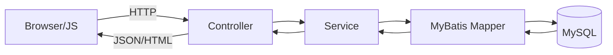
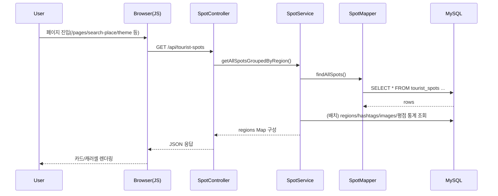
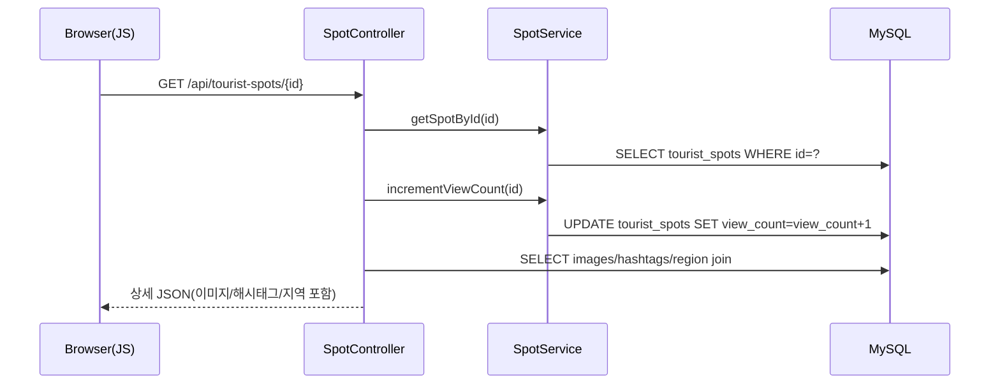
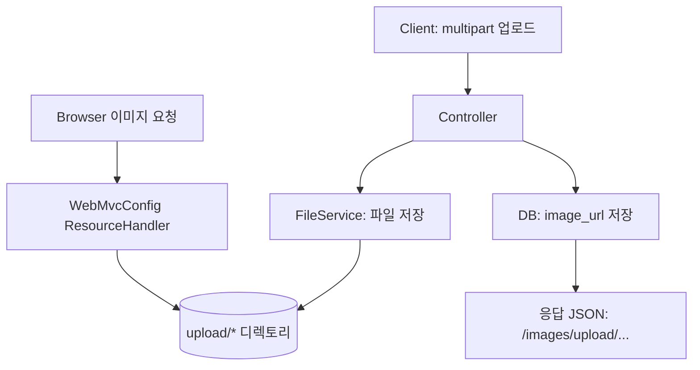

## 데이터플로우(Data Flow)

### 0. 참고 문서(원본)

- `instruction/docs/PROJECT_ARCHITECTURE.md`
- `instruction/docs/API_SPECIFICATION.md`
- `instruction/docs/TABLE_DEFINITION.md`

---

### 1. 슬라이드 구성안(데이터플로우)

- **Slide 1**: 레이어드 아키텍처(Controller → Service → Mapper → DB)
- **Slide 2**: 핵심 데이터 모델(ERD 요약: 관광지/리뷰/좋아요/신청/신고)
- **Slide 3**: “검색(목록)” 데이터플로우
- **Slide 4**: “상세(조회수+이미지+해시태그)” 데이터플로우
- **Slide 5**: “리뷰/댓글/신고” 데이터플로우
- **Slide 6**: “좋아요(상태/토글)” 데이터플로우
- **Slide 7**: “이미지 업로드/서빙” 데이터플로우
- **Slide 8**: “관리자 운영” 데이터플로우

---

### 2. 아키텍처 데이터 경로(공통)

`instruction/docs/PROJECT_ARCHITECTURE.md` 기준.

- **Controller**: 요청 파라미터 검증/응답 스펙 구성
- **Service**: 트랜잭션/비즈니스 규칙(카테고리 활성, 평점 집계 등)
- **Mapper(XML)**: SQL 실행 및 DTO 매핑

---

### 3. 데이터 모델(테이블 관계) — 발표용 요약

`instruction/docs/TABLE_DEFINITION.md`의 핵심만 요약합니다.

- **관광지**
    - `regions` (지역)
    - `tourist_spots` (관광지)
    - `tourist_spot_images` (관광지 이미지, `rep_img_yn`)
    - `hashtags` + `tourist_spot_hashtags` (해시태그 M:N)

- **사용자/프로필**
    - `users` (로그인/권한/상태/로그인타입)
    - `user_profile_images` (프로필 이미지 이력)

- **리뷰/상호작용**
    - `reviews` + `review_images`
    - `review_comments`
    - `review_likes`, `tourist_spot_likes`
    - `review_reports`, `comment_reports`

- **신청**
    - `spot_requests` (photo/spot/edit + status/reject_reason)

---

### 4. 검색(목록) 데이터플로우

#### 4.1 “전체 관광지(지역별 그룹화)” — 테마/테그/리스트 기본 데이터

- **API**: `GET /api/tourist-spots`
- **주요 응답**: `{ "regions": { "area01": { name, code, spots: [...] }, ... } }`

- **DB 접근 포인트(대표)**
    - `tourist_spots` + `regions`
    - 대표 이미지: `tourist_spot_images`에서 `rep_img_yn='Y'`
    - 해시태그: `tourist_spot_hashtags` + `hashtags`
    - 평점: `reviews` 집계(평균/개수) → 응답의 `ratingAvg`, `ratingCount`

#### 4.2 “지역 선택 관광지” — Place Page

- **API**: `GET /api/regions/spots?regionIds=...`
- **주의**: `instruction/PLACE_PAGE_SETUP.md` 기준, 프론트의 `regionIds`가 `regions.id`가 아니라 `regions.sigungu_code`로 쓰일 수 있음(구현/SQL 기준으로 발표에서 한 줄 언급 추천).

---

### 5. 관광지 상세 데이터플로우

- **API**: `GET /api/tourist-spots/{id}`

- **포인트**
    - 상세 진입 시 조회수 증가(데이터 변화가 있는 대표 시나리오)
    - 카테고리 활성/비활성 처리(`SPOT_CATEGORY` 공통코드 기반)

---

### 6. 리뷰/댓글/신고 데이터플로우(요약)

#### 6.1 리뷰 조회

- `GET /api/reviews?touristSpotId={spotId}&userId={optional}`
    - `userId`가 있으면 `isLiked` 포함

#### 6.2 리뷰 작성(이미지 포함 가능)

- `POST /api/reviews` (multipart 또는 JSON)
    - 이미지가 있으면 `review_images` 저장 + `/images/upload/reviews/**`로 서빙

#### 6.3 댓글 CRUD / 신고

- 댓글: `GET/POST /api/reviews/{reviewId}/comments`, `PUT/DELETE /api/comments/{commentId}`
- 신고: `POST /api/reviews/{reviewId}/report`, `POST /api/comments/{commentId}/report`
    - `review_reports`, `comment_reports`에 기록

---

### 7. 좋아요 데이터플로우(요약)

#### 7.1 관광지 좋아요

- 상태 조회: `GET /api/tourist-spots/{spotId}/like?userId={optional}`
- 토글: `POST /api/tourist-spots/{spotId}/like?userId={userId}`
- 저장: `tourist_spot_likes` (unique: user_id + tourist_spot_id)

#### 7.2 리뷰 좋아요

- 상태 조회/토글: `GET/POST /api/reviews/{reviewId}/like?userId={userId}`
- 저장: `review_likes` (unique: user_id + review_id)

---

### 8. 이미지 업로드/서빙 데이터플로우(신청/리뷰/프로필)

`PROJECT_ARCHITECTURE.md`의 업로드/서빙 구조 요약.

- **서빙 URL**
    - `/images/upload/spots/**`
    - `/images/upload/profiles/**`
    - `/images/upload/reviews/**`

---

### 9. 관리자 운영 데이터플로우(요약)

- 관리자는 `/api/admin/**`를 통해 운영 데이터(관광지/유저/공통코드/신청/신고)를 조회/변경합니다.
- 신청 승인 시:
    - `spot_requests.status` 업데이트
    - photo 승인인 경우 `tourist_spot_images`에 이미지 추가될 수 있음(대표 이미지 조건 포함)
