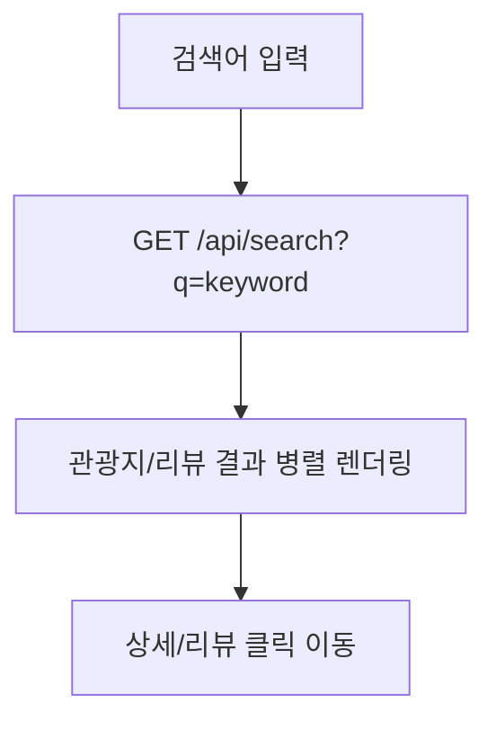

## 워크플로우(Workflow)

### 0. 참고 문서(원본)

- `instruction/docs/MENU_STRUCTURE.md`
- `instruction/docs/PROJECT_ARCHITECTURE.md`
- `instruction/docs/TEST_CASES.md`
- `instruction/PLACE_PAGE_SETUP.md`

---

### 1. 슬라이드 구성안(워크플로우)

- **Slide 1**: 서비스 소개(무엇을 해결?) + 핵심 기능(검색/상세/리뷰/좋아요/신청/관리자)
- **Slide 2**: 전체 사용자 여정(메뉴 구조 기반)
- **Slide 3**: 관광지 검색 워크플로우(지역/태그/테마/통합)
- **Slide 4**: 관광지 상세 워크플로우(지도/리뷰/좋아요/프로필 이동)
- **Slide 5**: 인증/마이페이지 워크플로우(로그인/회원가입/프로필/타인 프로필)
- **Slide 6**: 신청 워크플로우(사진 추가/관광지 추가/수정요청/취소)
- **Slide 7**: 관리자 워크플로우(관광지/유저/공통코드/신청/신고)
- **Slide 8**: 테스트(워크플로우 검증 근거: 테스트케이스 ID 일부 소개)

---

### 2. 전체 사용자 여정(메뉴/화면 흐름)

`instruction/docs/MENU_STRUCTURE.md`의 페이지 엔드포인트 기준.

- **메인/정적 정보**
    - `/` 메인
    - `/pages/about-busan/*` 부산 소개
    - `/pages/about-orora/orora-introduce` 소개
    - `/pages/tip/tip` 여행팁

- **관광지 탐색(핵심)**
    - 지역 검색: `/pages/search-place/place`
    - 태그 검색: `/pages/search-place/tag`
    - 테마 검색: `/pages/search-place/theme`
    - 통합 검색: `/pages/search-place/search`
    - 상세: `/pages/detailed/detailed?id={spotId}`

- **사용자(인증/프로필)**
    - 로그인: `/pages/login/login` (+ OAuth2: `/oauth2/authorization/{kakao|google}`)
    - 회원가입: `/pages/login/signup`
    - 마이페이지: `/pages/mypage/mypage`
    - 프로필 수정: `/pages/mypage/edit-profile`
    - 타인 프로필: `/pages/profile/{userId}` (마이페이지 템플릿 재사용, 리뷰 탭만 노출)

- **관리자(운영)**
    - 관리자 페이지: `/pages/admin/management`

---

### 3. 관광지 검색 워크플로우(지역/태그/테마/통합)

#### 3.1 지역 검색(`/pages/search-place/place`) — Place Page 상세

`instruction/PLACE_PAGE_SETUP.md` 기반(지도 클릭 → 리스트 갱신).

```mermaid
flowchart TD
  A[사용자: /pages/search-place/place 진입] --> B[지도 SVG 로드]
  B --> C[지역 클릭(다중 선택)]
  C --> D[선택 상태 저장(Set)]
  D --> E[GET /api/regions/spots?regionIds=...]
  E --> F[리스트 카드 렌더링]
  F --> G[상세로 이동 /pages/detailed/detailed?id=...]
```

- **핵심 UX**
    - 다중 선택(토글) + 선택 해제 + 선택된 지역만 보기
    - 리스트는 우측 sticky 형태로 사용자 시선을 유지
- **구현 포인트**
    - 지도 SVG의 `sigungu-code`를 `regionIds`로 전송
    - 주의: 문서 기준 `regionIds`는 `regions.id`가 아니라 `regions.sigungu_code`로 사용될 수 있음(현 구현/SQL 기준 확인 필요)

#### 3.2 태그 검색(`/pages/search-place/tag`)

```mermaid
flowchart TD
  A[태그 검색 페이지 진입] --> B[태그/지역별 데이터 로드]
  B --> C[GET /api/tag-spots]
  C --> D[태그/지역별 그룹 렌더링]
  D --> E[관광지 카드 클릭]
  E --> F[/pages/detailed/detailed?id=...]
```

#### 3.3 테마 검색(`/pages/search-place/theme`)

- 테마 선택 → 테마별 필터링 → 리스트/그리드 렌더링
- 참고: `instruction/THEME_PAGE_SETUP.md` (테마 전용 상세 문서)

#### 3.4 통합 검색(`/pages/search-place/search`)



---

### 4. 관광지 상세 워크플로우(`/pages/detailed/detailed?id={spotId}`)

```mermaid
flowchart TD
  A[상세 페이지 진입] --> B[상세 데이터 로드]
  B --> C[GET /api/tourist-spots/{id}]
  C --> D[이미지/해시태그/지역/지도 표시]
  D --> E[리뷰 탭 로드]
  E --> F[GET /api/reviews?touristSpotId={id}]
  D --> G[좋아요 상태]
  G --> H[GET /api/tourist-spots/{id}/like?userId=...]
  H --> I[좋아요 토글]
  I --> J[POST /api/tourist-spots/{id}/like?userId=...]
  E --> K[작성자 클릭]
  K --> L[/pages/profile/{userId}]
```

- **핵심 포인트**
    - 상세 진입 시 조회수 증가(백엔드)
    - 리뷰/댓글/포토리뷰에서 작성자 클릭 → 타인 프로필로 이동

---

### 5. 인증/마이페이지 워크플로우

#### 5.1 로그인/회원가입

- 로그인: `POST /api/auth/login` → 성공 시 세션 저장 → 헤더 UI 변화
- 회원가입: `POST /api/auth/signup` (프로필 이미지 포함 가능)
- 소셜 로그인: `/oauth2/authorization/{kakao|google}` → 성공 시 `/` 리다이렉트

#### 5.2 마이페이지/타인 프로필

- 마이페이지: `/pages/mypage/mypage`
- 타인 프로필: `/pages/profile/{userId}`
    - **프로필 수정 버튼 숨김**
    - **리뷰 탭만 노출**

---

### 6. 신청 워크플로우(사용자 → 관리자 승인)

- **사진 추가 신청**: `POST /api/spot-requests/photo` (이미지 업로드)
- **관광지 추가 신청**: `POST /api/spot-requests/spot` (단일/다중 이미지 업로드)
- **정보 수정 요청**: `POST /api/spot-requests/edit`
- **신청 취소**: `DELETE /api/spot-requests/{requestId}?userId={userId}`

```mermaid
flowchart TD
  A[사용자: 신청 제출] --> B[status=pending 저장]
  B --> C[관리자: 신청 목록 조회]
  C --> D[GET /api/admin/spot-requests]
  D --> E[승인/거부]
  E --> F[PUT /api/admin/spot-requests/{id}/approve]
  E --> G[PUT /api/admin/spot-requests/{id}/reject]
```

---

### 7. 관리자 워크플로우(운영 기능)

- **관광지 관리**: `/pages/admin/management` + `GET/POST/PUT/DELETE /api/admin/tourist-spots`
- **유저 관리**: `GET/POST/PUT/DELETE /api/admin/users`
- **공통코드 관리**: `GET/POST/PUT/DELETE /api/admin/common-code-groups`, `/api/admin/common-codes`
- **신청 관리**: `GET /api/admin/spot-requests` + approve/reject/delete
- **신고 관리**: `GET /api/admin/user-reports` + process/delete

---

### 8. 워크플로우 검증 근거(테스트케이스 추천 인용)

발표에서는 “구현했다” 뿐 아니라 “검증했다” 근거로 아래를 요약 인용하면 좋습니다.

- **로그인/회원가입**: TC-AUTH-001 ~ TC-AUTH-026
- **타인 프로필 이동**: TC-PROFILE-001 ~ TC-PROFILE-003
- **관광지 상세/리뷰**: TC-SPOT-001 ~, TC-REVIEW-001 ~
- **좋아요**: TC-LIKE-001 ~
- **관리자**: TC-ADMIN-001 ~
