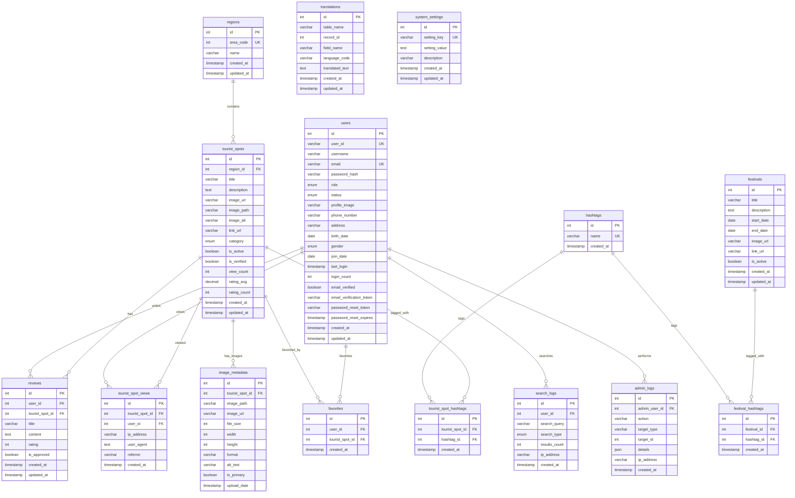

# 부산 관광 가이드 데이터베이스 ERD

## 📊 Entity Relationship Diagram



## 🏗️ 테이블 구조 상세

### 1. 핵심 비즈니스 엔티티

#### regions (지역)

-   **목적**: 부산의 16개 구/군 정보 관리
-   **주요 필드**: area_code (행정구역코드), name (지역명)
-   **관계**: 1:N → tourist_spots

#### tourist_spots (관광지)

-   **목적**: 부산 관광지 정보 관리
-   **주요 필드**: title, description, image_url, category, rating_avg
-   **관계**: N:1 ← regions, 1:N → reviews, 1:N → tourist_spot_views

#### users (사용자)

-   **목적**: 회원 및 관리자 계정 관리
-   **주요 필드**: user_id, email, role, status
-   **관계**: 1:N → reviews, 1:N → favorites, 1:N → search_logs

### 2. 콘텐츠 관리

#### hashtags (해시태그)

-   **목적**: 관광지 및 축제 태그 관리
-   **주요 필드**: name (태그명)
-   **관계**: N:M ↔ tourist_spots, N:M ↔ festivals

#### reviews (리뷰)

-   **목적**: 사용자 관광지 리뷰 관리
-   **주요 필드**: title, content, rating, is_approved
-   **관계**: N:1 ← users, N:1 ← tourist_spots

#### festivals (축제/이벤트)

-   **목적**: 부산 축제 및 이벤트 정보 관리
-   **주요 필드**: title, start_date, end_date, is_active
-   **관계**: N:M ↔ hashtags

### 3. 사용자 활동 추적

#### tourist_spot_views (조회 기록)

-   **목적**: 관광지 조회 통계 및 사용자 행동 분석
-   **주요 필드**: ip_address, user_agent, referrer
-   **관계**: N:1 ← tourist_spots, N:1 ← users

#### favorites (즐겨찾기)

-   **목적**: 사용자 관광지 즐겨찾기 관리
-   **주요 필드**: user_id, tourist_spot_id
-   **관계**: N:1 ← users, N:1 ← tourist_spots

#### search_logs (검색 기록)

-   **목적**: 사용자 검색 패턴 분석
-   **주요 필드**: search_query, search_type, results_count
-   **관계**: N:1 ← users

### 4. 미디어 및 다국어 지원

#### image_metadata (이미지 메타데이터)

-   **목적**: 관광지 이미지 정보 관리
-   **주요 필드**: image_path, file_size, width, height, format
-   **관계**: N:1 ← tourist_spots

#### translations (번역)

-   **목적**: 다국어 콘텐츠 관리
-   **주요 필드**: table_name, record_id, field_name, language_code
-   **관계**: 독립적 (다른 테이블의 번역 데이터)

### 5. 시스템 관리

#### admin_logs (관리자 로그)

-   **목적**: 관리자 활동 추적 및 감사
-   **주요 필드**: action, target_type, target_id, details
-   **관계**: N:1 ← users

#### system_settings (시스템 설정)

-   **목적**: 애플리케이션 설정 관리
-   **주요 필드**: setting_key, setting_value, description
-   **관계**: 독립적

## 🔗 주요 관계 패턴

### 1. 계층적 관계

```
regions (1) → tourist_spots (N) → reviews (N)
```

### 2. 다대다 관계

```
tourist_spots (N) ↔ hashtags (N) via tourist_spot_hashtags
festivals (N) ↔ hashtags (N) via festival_hashtags
```

### 3. 사용자 활동 관계

```
users (1) → {reviews, favorites, search_logs, tourist_spot_views} (N)
```

### 4. 확장 가능한 구조

-   **번역 시스템**: translations 테이블로 모든 테이블의 다국어 지원
-   **이미지 관리**: image_metadata로 다중 이미지 지원
-   **활동 추적**: views, favorites, search_logs로 사용자 행동 분석

## 📈 성능 최적화 인덱스

### 주요 인덱스

-   **검색 성능**: tourist_spots(category, is_active, rating_avg)
-   **사용자 활동**: users(user_id, email, role)
-   **관계 조회**: tourist_spot_hashtags(tourist_spot_id, hashtag_id)
-   **시간 기반**: 모든 테이블의 created_at 인덱스

### 복합 인덱스

-   **지역별 관광지**: tourist_spots(region_id, is_active)
-   **사용자 리뷰**: reviews(user_id, tourist_spot_id)
-   **검색 로그**: search_logs(user_id, created_at)

## 🎯 비즈니스 규칙

### 1. 데이터 무결성

-   **CASCADE 삭제**: regions 삭제 시 관련 tourist_spots 자동 삭제
-   **SET NULL**: users 삭제 시 search_logs의 user_id만 NULL로 설정
-   **UNIQUE 제약**: user_id, email, hashtag name 중복 방지

### 2. 비즈니스 로직

-   **평점 시스템**: rating_avg와 rating_count로 평점 관리
-   **승인 시스템**: reviews의 is_approved로 리뷰 승인 관리
-   **활성화 관리**: is_active로 콘텐츠 활성화 상태 관리

### 3. 확장성 고려

-   **다국어 지원**: translations 테이블로 모든 텍스트 필드 번역 가능
-   **이미지 관리**: image_metadata로 다중 이미지 및 메타데이터 관리
-   **활동 추적**: views, favorites, search_logs로 상세한 사용자 행동 분석
